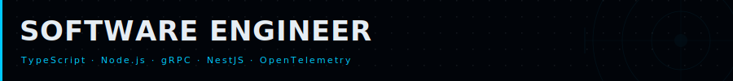
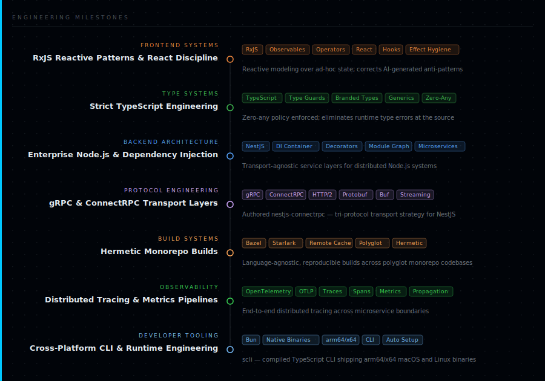

---

<table>
<tr>
<td valign="top" width="55%">

**About**

Backend-focused software engineer with over a decade of shipping production systems. I specialize in **TypeScript/Node.js** microservices, **gRPC/ConnectRPC** transport layers, and **observability pipelines**.

**Tech Stack**

</td>
<td valign="top" width="45%">

<!-- 
 -->

</td>
</tr>
</table>

---

## Engineering Milestones

---

**[ssilve1989.github.io](https://ssilve1989.github.io)**

